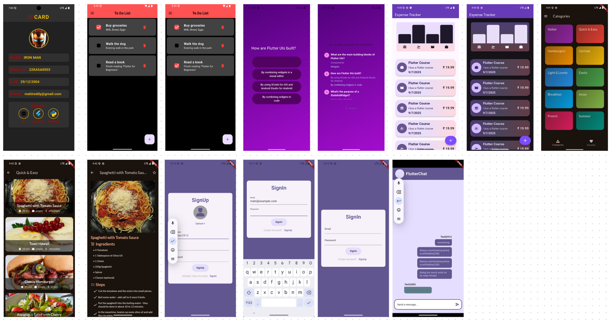

# 📱 Flutter Apps Collection  

This repository contains all the Flutter apps I have developed while learning and experimenting with different concepts.  
Each app is built from scratch, and I learned by making mistakes, debugging, and improving step by step.  
Sometimes AI helped me understand things faster, but at the end of the day, **a developer must know and build everything** 💻✨.  

---

## 🖼️ Apps Showcase  

<p align="center">
  
</p>

*(Above image shows a grid view of all app screenshots together)*  

---

## ⚒️ Tech Stack  

- [Flutter](https://flutter.dev/)  
- [Dart](https://dart.dev/)  
- Firebase (for some apps)  
- REST APIs (for some apps)  

---

## 🚀 Getting Started  

Clone this repo and run any app:  

```bash
git clone https://github.com/BBB2912/Flutter_Apps_Learning.git
cd Flutter_Apps_Learning
flutter pub get
flutter run
